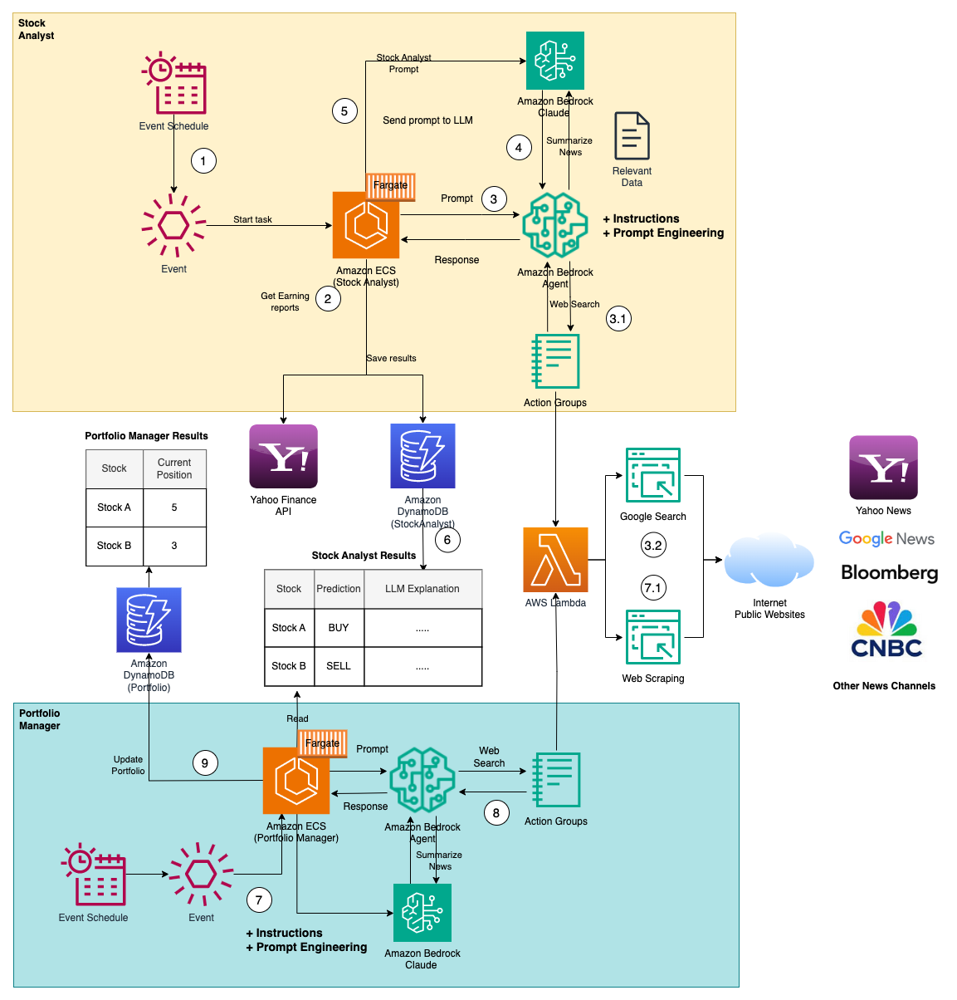
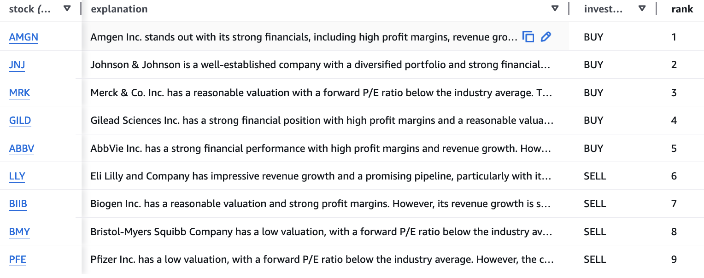

## Stock Analysis with LLMs and AWS Bedrock Agents

This project aims to develop an automated system for stock analysis and portfolio management, using different data sources such as balance sheet data, technical indicators, news, industry information, and general market sentiment. Powered by large language models (LLMs) like Claude 3 and leveraging the AWS Bedrock infrastructure.

### Key Features

**Stock Analyst Module**
- Weekly stock analysis on S&P 500, Nasdaq 100 and EURO STOXX 50, ranks each stock in its respective industry based on:
   - Balance sheet information
   - Technical indicators
   - Relevant news for each stock
- LLMs ranks stocks within their respective industries and stores reasoning
- BUY/SELL recommendations for each stock
- Stores results in a database for further analysis and trend tracking.

**Portfolio Manager Module**
- Weekly updates portfolio by buying (BUY) or selling stocks (SELL) based on the stock analyst's recommendations and general market sentiment.
- Allows user prompts to influence the selection and weighting of stocks in the portfolio.
- Stores portfolio in a database for further analysis and inspection

> **Note:** No real trades are executed, stock data comes from YAHOO API.

### Architecture Overview



The stock analysis application leverages various AWS services and external APIs. The key components and steps involved are as follows:

1. The process is triggered by an AWS EventBridge event.
2. The event initiates a task within the AWS Elastic Container Service (ECS), which fetches earnings reports from the Yahoo Finance API.
3. A prompt is sent to an Amazon Bedrock Agent, which performs web searches and summarizes key data points and relevant news for each stock.
4. The Amazon Bedrock Claude service summarizes the news and relevant data gathered.
5. Earnings reports, news, and industry benchmarks are sent to Amazon Bedrock Claude to rank stocks within their industries.
6. The LLM's recommendation, along with the summarized data, is saved in an Amazon DynamoDB database.
7. The portfolio management process is triggered by an AWS EventBridge event.
8. A prompt is sent to an Amazon Bedrock Agent to collect general market news.
9. The LLM acts as a portfolio manager with the information provided by the analyst and updates the portfolio accordingly.

### Example Usage

**Compare individual stocks:**

Change `src/config.ini` to compare individual stocks against each other and rank them.

Example `src/config.ini`:
```
COMPARE_SYMBOLS_WITHOUT_INDUSTRY = true
INDEX_SYMBOLS = 
SYMBOLS = EVD.F,ENR.F
```
Result:
```
  [
      {
       'name': 'Siemens Energy AG',
       'rank': 1,
       'explanation': "Siemens Energy AG has shown impressive growth and a strong turnaround in profitability, reporting net income of 289 million euros in Q3 2024 compared to a loss in the previous year. The stock has quadrupled in price over 2024, hitting new all-time highs. Analysts have raised their price targets and maintain 'Buy' ratings, citing the company's positive outlook. With a forward P/E of 20.94 and a PEG ratio in line with industry averages, the stock appears undervalued given its growth potential in the renewable energy sector.",
       'investment_decision': 'BUY'
      },
      {
       'name': 'CTS Eventim AG & Co. KGaA',
       'rank': 2,
       'explanation': "CTS Eventim has reported strong financial results with revenue and EBITDA growth in the double digits for the first nine months of 2024. The company has secured major ticketing contracts like the 2024 Paris Olympics and 2026 Milan Winter Olympics. It is also expanding its live entertainment business with new arena projects. While the stock trades at a premium valuation with a forward P/E of 23.52, its growth prospects and leading market position in the events industry justify a 'Buy' rating.",
       'investment_decision': 'BUY'
      }
  ]
```
**Compare all stocks within indexes:**

Note: Adding indexes can result in high costs when using Bedrock for comparison, due to the large number of stocks involved.

Example `src/config.ini`:
```
COMPARE_SYMBOLS_WITHOUT_INDUSTRY = false
INDEX_SYMBOLS = S&P 500,NASDAQ 100
SYMBOLS = 
```
Result:
Ranking of each stock in the index against its industry:

### Getting Started

1. Deploy the infrastructure:
   ```
   cd infrastructure
   cdk deploy
   ```
2. Run the Python script `infrastructure/deploy_agents.py` to set up the Amazon Bedrock Agents, as this is currently not supported by AWS CDK. You need to add the IAM Role created by CDK to allow the agent to invoke bedrock model to the script. If the script fails because of the alias creation, do step 3 below and then create the agent alias manually in the console.
3. Configure the Action Groups and Agent settings in the Amazon Bedrock Agent console.
   - Click on `Agents`->`InternetSearchAgent`->`Edit in Agent Builder`->`Additional settings`-> Enable User Input
   - Click on `Add Action Group`
     - Enter Action group name `InternetSearch`
     - `Description`: this action group is use to google specific inputs 
     - Select the existing Lambda function created with CDK.
     - `Define inline schema` and copy the content from `src/schema/internet-search-schema.json`
     - Save end exit

   - Click edit agent. Go to advanced prompts settings. Toggle on the **Override pre-processing template defaults** radio button. Also make sure the **Activate pre-processing template** radio button is enabled.
   - Under *prompt template editor*, you will notice that you now have access to control the pre-built prompts. Scroll down to until you see "Category D". Replace this category section with the following:

      ```text
     -Category D: Questions that can be answered by internet search, or assisted by our function calling agent using ONLY the functions it has been provided or arguments from within <conversation_history> or relevant arguments it can gather using the ask user function.
      ```
   - Scroll down and select **Save & Exit**.

4. Update the values in the `src/config.ini` and run again `cdk deploy`.
5. You need to enable Anthropic Claude 3 model access in the AWS Bedrock Console.
6. Test the agent in the Console by running the following user input `Amazon stock news`, and see if the result matches recent news.

### Results

For results, see `documentation/RESULTS.md`.

### Prompt Engineering

To improve the performance and behavior of the models, you can modify the prompts in the file `src/schema/prompts.yaml`.

### Financial Data Collected

The project collects a comprehensive set of financial performance metrics, valuation and market position data, governance and risk factors, industry comparisons, and company information for each stock.

### Improvements

- Self host model to reduce costs
- Add more examples, results and describe data sources better

### References

- [Bedrock Agents Webscraper](https://github.com/build-on-aws/bedrock-agents-webscraper)
- [BFI Working Paper](https://bfi.uchicago.edu/wp-content/uploads/2024/05/BFI_WP_2024-65.pdf)

### License

This project is licensed under the MIT License. Feel free to use and modify the code as needed.
